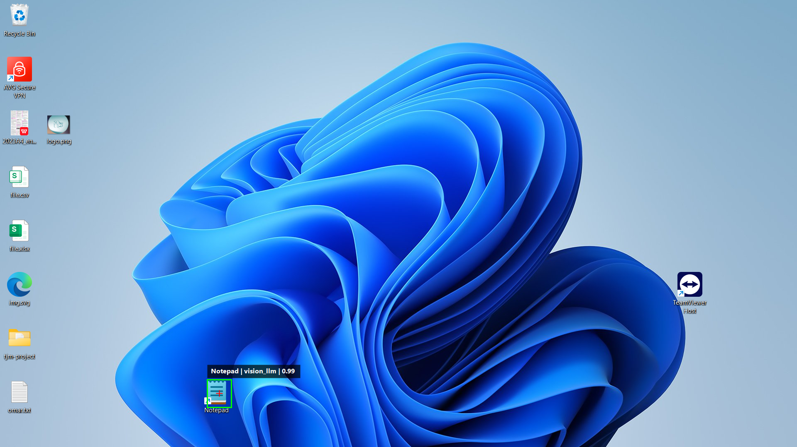
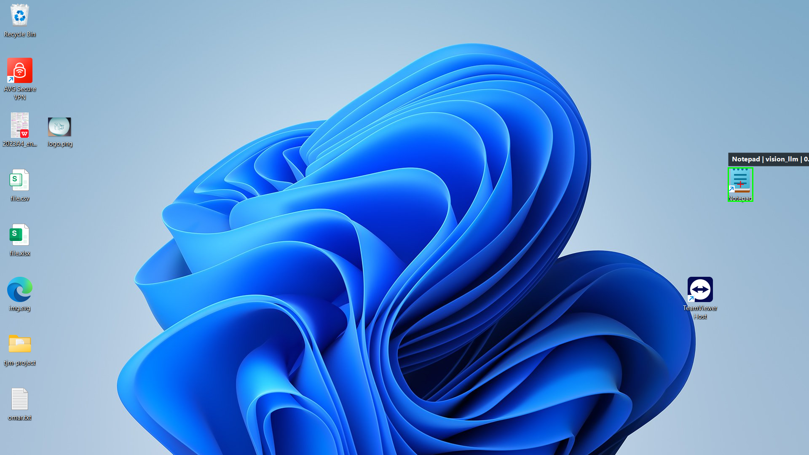
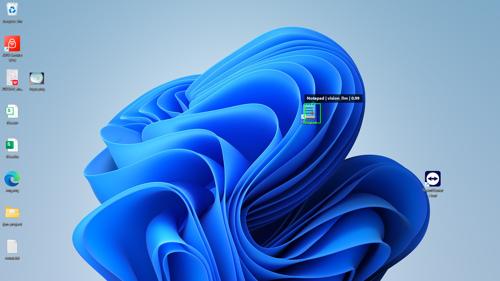

# tjm-interview

Automates fetching JSONPlaceholder posts, opening Notepad from the desktop, writing each post into a text file, and saving the result.

**Setup**
```powershell
python -m pip install -e .
Copy-Item .env.example .env
```

Set these in `.env`:
- `TJM_VLM_BASE_URL`
- `TJM_VLM_API_KEY`
- `TJM_VLM_MODEL`

Adjust runtime settings in [app.toml](d:/Maestro/MaestroXII/TJMInterview/tjm-interview/config/app.toml), especially `save_dir`, timeouts, and delays.

**Run**
```powershell
python -m tjm_automation run-one --post-id 1
python -m tjm_automation run-assignment
```

Output files are saved to `save_dir`, and screenshots/debug artifacts go to `artifacts/`.

**Grounding Examples**

The system takes a desktop screenshot, asks the vision model to locate the Notepad icon, draws the detected box/point, then clicks that location to launch the app.






